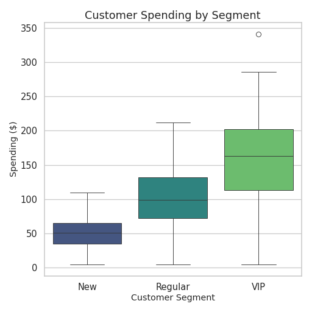

# Circle Packing Chart for Investment Portfolio

This repository contains a Circle Packing chart that visualizes investment portfolio allocation across different sectors and assets.

Contact: 24f1002255@ds.study.iitm.ac.in

## Chart

The chart below was generated using Python with the `circlify` and `matplotlib` libraries.

Average: 5.66
Industry Target: 8
