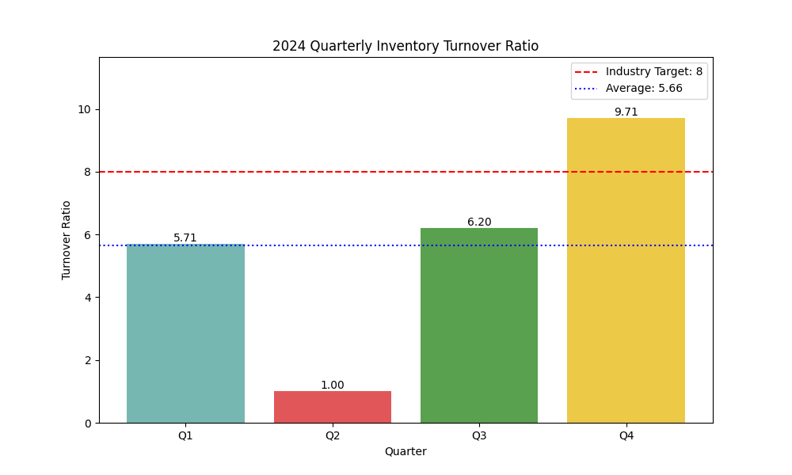

# Inventory Turnover Ratio Analysis - 2024

Contact: 24f1002255@ds.study.iitm.ac.in

This report provides an analysis of the company's inventory turnover ratio for the four quarters of 2024. The inventory turnover ratio is a key metric for evaluating how efficiently a company is managing its inventory.

## Data Analysis

The analysis is based on the following quarterly data:

| Quarter | Inventory Turnover Ratio |
|---|---|
| Q1 | 5.71 |
| Q2 | 1.00 |
| Q3 | 6.20 |
| Q4 | 9.71 |

**The average inventory turnover ratio for 2024 is 5.66.**

## Visualization

The following chart shows the quarterly inventory turnover ratio compared to the industry target of 8.

## Key Findings

*   **High Volatility:** The inventory turnover ratio shows extreme volatility, with a dramatic dip in Q2 (1.00) and a sharp peak in Q4 (9.71).
*   **Below Target:** The average turnover ratio of 5.66 is significantly below the industry target of 8.
*   **Inconsistent Performance:** The company's performance is inconsistent, with only Q4 surpassing the industry benchmark.

## Business Implications

*   **Lost Sales & High Costs:** The low turnover in Q2 suggests overstocking, which ties up capital and increases holding costs. Conversely, the very high turnover in Q4 might indicate under-stocking, potentially leading to lost sales.
*   **Inefficient Supply Chain:** The volatility points to potential issues in the supply chain and demand forecasting. The company is not consistently matching inventory levels with customer demand.
*   **Reduced Profitability:** Inefficient inventory management negatively impacts profitability due to increased costs and potential lost revenue.

## Recommendations

To improve the inventory turnover ratio and reach the target of 8, the following actions are recommended:

*   **Optimize Supply Chain:** Implement a more agile and responsive supply chain to better manage inventory flows. This includes improving supplier relationships and reducing lead times.
*   **Improve Demand Forecasting:** Utilize advanced data analytics and forecasting models to predict customer demand more accurately. This will help in maintaining optimal inventory levels.
*   **Implement Inventory Management System:** Adopt a modern inventory management system to provide real-time visibility into inventory levels and automate reordering processes.

By implementing these recommendations, the company can achieve a more stable and efficient inventory management process, leading to improved profitability and a stronger competitive position.
